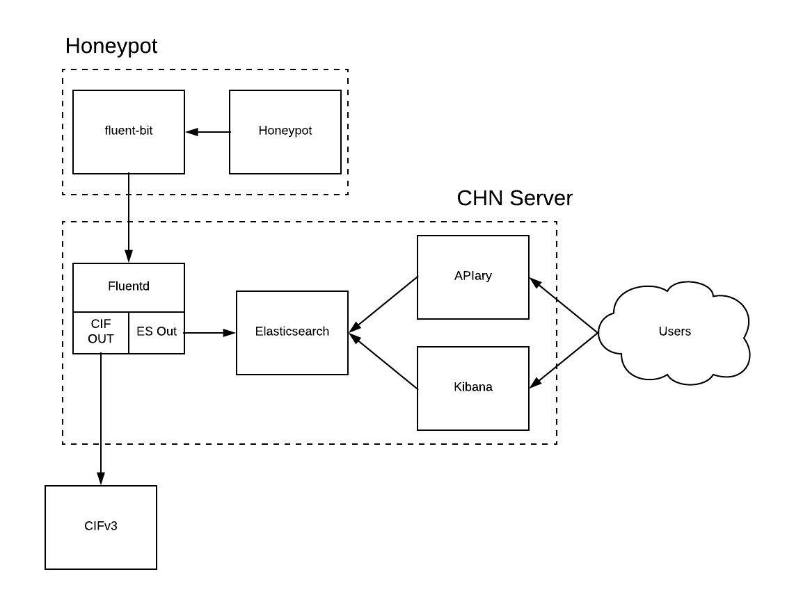

# stingar-fluentd-demo

Fluentd Proof of Concept for STINGAR project. This repository borrows heavily, and extends upon, @clcollin's fluentd PoC found [here](https://github.com/clcollins/Honeypot-FluentBit-EFK)


## Running

Begin by building and starting the CIF container in order to retrieve the authentication token from CIFv3.

```
docker-compose up cif
```

Update the "cif_token" option in stingar.env with the authentication token returned by CIFv3

Start all of the containers in the docker-compose file:

```
docker-compose up
```

SSH to localhost:22 to generate honeypot events.

Check for indicators in CIFv3 using the following command, replacing "token=xxxxx" with the token returned earlier by CIFv3:

```
curl -H "Authorization: Token token=xxxxx" http://localhost:5000/indicators
```

Navigate to localhost:5601 in a web browser. After adding the "stingar*" index pattern in Kibana, you should see events corresponding to your login attempts.


## To Do
* Certificate based authentication for fluentd
* More robust API functions
* Authentication for API
* Ability to specify fluentd output modules at runtime


## Architecture

